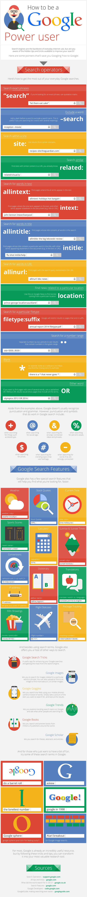

# How to use Google Search

As a beginner you will face various of issues, errors which you haven't seen before. In-fact it happens to every developer. Using Google to find solutions is a very good skill for everyone to learn.

If you come across any kind of error don't panic and google the error code. 99% of the time you can search the error and fix it.

Here are few pointers on how you can use Google effectively.

## Searching

### Extact phrase

If you are looking for an exact phrase, use quotation marks. Sometimes an error code or message can be a bit specific (might mention a line of code, method name, variable name that is from your project.). In that case try to make the search a bit less specific.

```text
"'undefined' is not an object"
```

### Boolean searches

You can use `AND`, `OR`, `NOT` in your Google search. Make sure to enter these in caps.

```text
motorbike OR motorcycle
```

You can use `-` sign that will do the same thing as `NOT`. This is useful if you are searching for a word with several meanings.

```text
dreamcatcher -movie
```

### Within a site

Get results from a certain domains.

```text
how to maintain a healthy beard site:reddit.com
```

### Similar

Find sites with similar content.

```text
related:udemy.com
```

### Optionals

